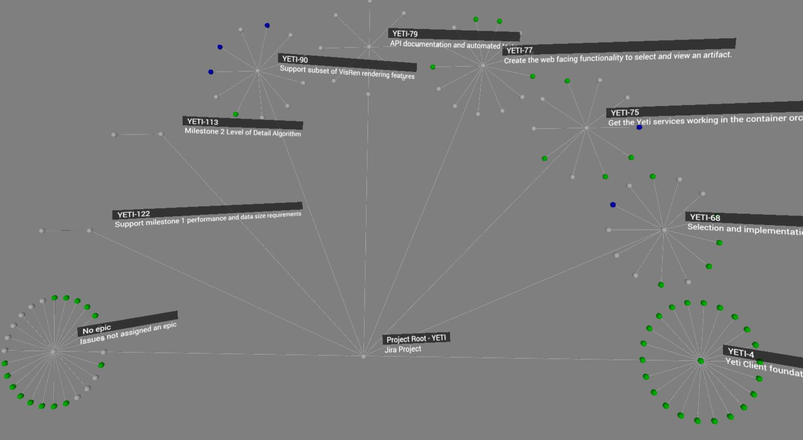

# JiraTree
A plugin set that displays Jira issues in Visionary Render

## Modules
There are two plugins here - both are required.

### 1. JiraTree-Metanodes
This is a native plugin that uses the C API to define two new metanodes - JiraConnection and JiraProject.
The C API is the only API that can define new node types.

### 2. JiraTree
This is the rest of the implementation, written in Lua.

This is a Lua plugin because a number of operations it performs are easier to do using the built-in functionality either in Lua, or Visionary Render itself. Of course this can also be implemented with the C API, but it would require a number of third party libraries (e.g. curl) to do the HTTP requests, and a threading implementation, or a lot of FFI wrangling to call into Lua to access the functionality.

## Install
Try it out using the following steps

1. Download / clone this repo
2. Build the JiraTree-Metanodes plugin
    1. Run cmake on the jiratree-metanodes directory
    2. Set the cache variable for the VRTree SDK (usually in your Visionary Render install directory, in `data/vrtreesdk`)
    3. Generate the build scripts (Visual Studio 2015 or above recommended)
    4. Build the project
    5. The resulting jiratree.dll can be copied to your VisRen plugins directory, in a subfolder (e.g. `jiratree-metanodes`) with an accompanying `plugin.txt` containing the text `jiratree.dll`
3. Copy the jiratree directory to your VisRen plugins directory
4. Run VisRen - verify plugins loaded in Plugin manager UI

## Usage
1. Right click in tree -> Create -> Jira Tree -> Connection
2. Set the Jira API URL, user name, and API token fields
3. Right click in tree -> Create -> Jira Tree -> Project
4. Link the Connection property to the Connection node from step 1
5. Set either a project key (to get all issues from a project), or a custom JQL string, URL encoded
6. Wait for the request to complete and generate the tree

## License
MIT
